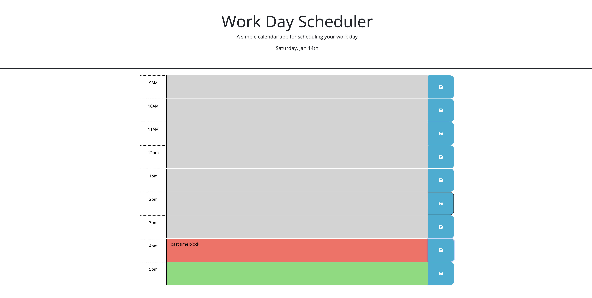

# work-day-custom-scheduler

[Link to my project](https://alandis01.github.io/work-day-scheduler/)

## table-of-contents
-[Description of project](#description-of-proejct)
-[Visuals](#visuals)

## description-of-project
I have created a work day scheduler that will allow you to enter notes during a certain time block, and click the save button to save that note. The application will interact with the current date and time to show time blocks of past, present, and future. The current date will display at the top of the application. 

##visuals

